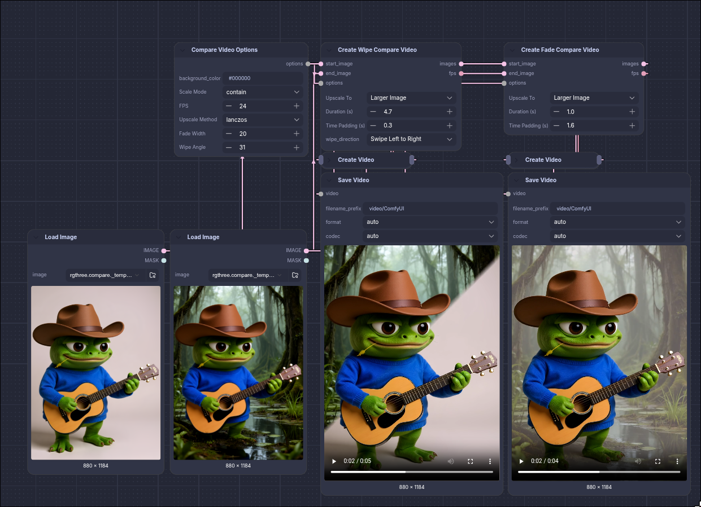
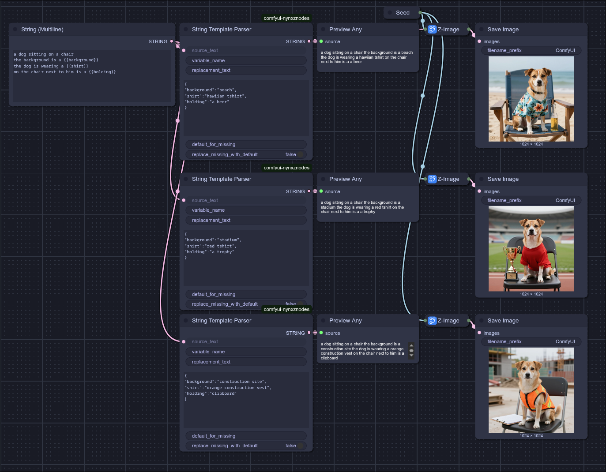

# Nynx'z Custom Nodes

[](https://registry.comfy.org/publishers/nynxz/nodes/comfyui-nynxz-nodes)

## Nodes

### LoRA

- **LoRA Loader** — a whole LoRA stack on one node: an on/off dot, a searchable picker with
  bookmarks and previews, and a strength per row. `MODEL` in, `MODEL` out.
- **LoRA Loader (CLIP)** — the same, patching `CLIP` as well.

### Regions — LoRAs gated to part of the image

A LoRA cannot be masked. Conditioning can (`ConditioningSetMask` is regional prompting and it works),
but a LoRA is a *weight* patch — merge two character LoRAs and both deltas fire on every token, so
the identities blend and no amount of prompting separates them.

These nodes keep each LoRA **unmerged** and run it as a live side branch with a per-token gate, so
character B's delta never touches character A's tokens. The gate comes from a mask, which means
`SAM3 Detect` can find the regions and you never draw anything. Nothing here touches the
conditioning, so it composes with an ordinary `LoraLoader` for a global style.

> **Krea 2 only, and experimental.** The routing map is read out of that DiT's per-block attention
> hooks; `Regions Apply` fails loudly on any other architecture rather than silently gating nothing.

```
Regions from Masks ──> Region LoRAs ──> Regions Apply ──> MODEL ──> KSampler
        └────────────> Region Denoise ──> Region Latent ──> LATENT ──┘
```

- **Regions from Masks** — a `MASK` batch becomes numbered regions. `SAM3 Detect` with
  `individual_masks` on is the intended source. `grow` is the first knob to raise when the face is
  right but the outline is wrong.
- **Region LoRAs** — the whole assignment in one node: rows grouped under the region they land on,
  each with the same picker the LoRA Loader uses. **Drag a row's grip onto another region to move
  it there**, or onto "+ Region" for a new one. Several rows may share a region; their deltas add.
- **Region LoRA** — the single binding, chainable. For when the name comes from a wire.
- **Region Backdrop** — the region you'd otherwise build by hand: everything the others don't
  cover, or the whole frame. Chain it last. A LoRA on `everything` is a global one that still rides
  the commit schedule, which a stock `LoraLoader` can't.
- **Region Denoise** — how much of one region may be rewritten.
- **Region Latent** — encodes the source image and grades the denoise per region, so the background
  survives while the characters are rebuilt. Needs core's **Differential Diffusion** on the model.
- **Regions Apply** — patches the model. Every mechanism has an off position that recovers a
  baseline: `track=0` is a static mask, `preheat=1` is a LoRA from step 0, `refine=0` is no
  clustering. Turn them all off and this is plain regional LoRA, which is the thing to beat.

Two nodes exist only to answer "what actually happened", so the working nodes don't each carry a
report socket:

- **Region Inspect** — tap the regions wire anywhere: every mask as a `MASK` batch you can edit and
  feed back, a colour preview of all of them at once, and the bindings. The *pre*-sampling view.
- **Regions Preview** — the gate map that actually ran, against the mask it started from, so a bad
  mask, a subject that moved, and a LoRA bleeding for some other reason stop looking alike. Wire the
  sampler's `LATENT` in to sequence it after the run. The *post*-sampling view.

### Fusion — several reference images in one conditioning

Wire two references into an edit and the model gets one after the other; it takes what it likes
from each and the result is an average. Regional *prompting* can't fix that — there's only one
visual block to prompt against. So the blend happens inside the conditioning: each source is
encoded independently through the Qwen3-VL vision tower, and their visual tokens are mixed token by
token under a weight field you control — by spatial pattern or by content.

> Needs a **Qwen3-VL text encoder** (`qwen3vl_4b` / `qwen3vl_8b`) — which is what Krea 2 uses too,
> hence `Text Encode (Fusion)` rather than any one model's name.

```
Fusion Input ─┐
              ├─> Text Encode (Fusion) ──> CONDITIONING ──> KSampler
Fusion Images ┘             └────────────> fusion_inspect ──> Fusion Inspector
```

- **Fusion Input** — drop images onto an on-node grid; each carries its own strength, fit and mute,
  and they reorder by dragging. Reads files from `input/`, `temp/` or `output/` so every card shows
  a real thumbnail.
- **Fusion Images** — the wire-side collector: plain `IMAGE` sockets with one shared strength and
  fit. Chains with the grid either way round.
- **Text Encode (Fusion)** — the node that does the work. Prompt plus the fusion tuning.
- **Fusion Inspector** — hover the token grid to see which source won which cell, the per-source
  shares, and the settings that produced them. It shows the field that actually ran, captured
  inside the encode.

Fusion and the Regions group are separate things that share a word: fusion decides *which reference
wins a token*, Regions decides *which LoRA fires on one*.

### Qwen3-VL

- **Qwen3-VL Describe** — the same CLIP you feed `Text Encode (Fusion)`, run as an LLM: image +
  prompt → text, through ComfyUI's native generate path. No llama.cpp, no transformers, no second
  model in VRAM. Captioning, prompt expansion, VQA.

### Conditioning

- **Conditioning Sigma Gate** — restrict any conditioning to a slice of the denoise, in denoise
  percent or real sigma. Intersects with whatever schedule the conditioning already carries, so it
  stacks instead of overwriting.
- **Conditioning Variation** — a variation seed for the *prompt*. Nudges a conditioning in a seeded
  random direction so you get neighbours of the same prompt with the sampler seed untouched. The
  nudge is direction-only: each token keeps its magnitude, so the variation changes content rather
  than loudness.

### Create Compare Video

- Fade Compare Video
- Wipe Compare Video



### String Template Parser



## Contributing

Contributions are welcome! If you have ideas for improvements or have found bugs, feel free to:

- Open an issue
- Submit a pull request with proposed changes

## License

[MIT License](LICENSE)
